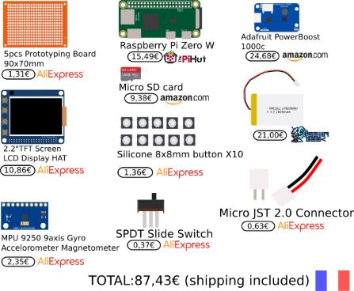
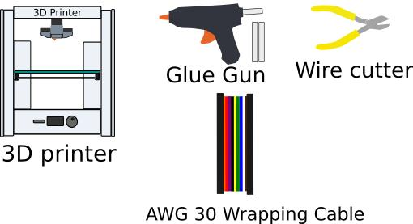

Console Retropie 
----------------
An easy to build, affordable portable console based on [pigrrl zero](https://learn.adafruit.com/pigrrl-zero/overview)   
BrainStorm : http://bigpictu.re/remi/retropieconsole
(Work in progress)

# What do you need

## Components


## Tools


# Wiring

## Wiring Power circuit
Based on Adafruit pigrrl zero: https://learn.adafruit.com/pigrrl-zero/software?view=all#power    


## Wiring Buttons
### Stripboard 

### Raspberry Pi


| IN/OUT | TOP/BOTTOM | POSITION  | COLOR  | GPIO | NAME             |
|--------|------------|-----------|--------|------|------------------|
| IN     | BOT        | 1         | BLACK  | GND  | GROUND (Pad)     |
| OUT    | BOT        | 4         | BLACK  | GND  | GROUND (Buttons) |
| IN     | TOP        | 4         | BLUE   | 4    | LEFT             |
| IN     | BOT        | 4         | PURPLE | 13   | RIGHT            |
| OUT    | BOT        | 3         | ORANGE | 16   | UP               |
| IN     | BOT        | 2         | BROWN  | 26   | DOWN             |
| IN     | BOT        | 5         | RED    | 6    | A                |
| IN     | TOP        | 7         | YELLOW | 27   | B                |
| OUT    | BOT        | 2         | BLUE   | 20   | Y                |
| IN     | TOP        | 6         | GREEN  | 17   | X                |
| OUT    | BOT        | 5         | YELLOW | 12   | LEFT TRIGGER     |
| IN     | BOT        | 7         | GREEN  |  1   | RIGHT TRIGGER    |

## Wiring MPU9250 (Optional)


# 3D print case
The case was created using Blender.    
We are working on model2 : http://bigpictu.re/remi/retropieconsole

Here a link with the current test model:
[portableRetropie/stl](https://github.com/madnerdorg/portableRetroPie/tree/master/stl)


# Install Retropie
* https://learn.adafruit.com/pigrrl-zero/software
* https://adafruit-download.s3.amazonaws.com/PiGRRL_Zero_20160912.zip

## Setup retropie

## Add poweroff button script
````
#!/usr/bin/python
import RPi.GPIO as GPIO
import time
import subprocess

GPIO.setmode(GPIO.BCM)

# we will use the pin numbering to match the pins on the Pi, instead of the
# GPIO pin outs (makes it easier to keep track of things)
# use the same pin that is used for the reset button (one button to rule them all!)
GPIO.setup(23, GPIO.IN, pull_up_down=GPIO.PUD_UP)

oldButtonState1 = True

while True:
    #grab the current button state
    buttonState1 = GPIO.input(23)

    # check to see if button has been pushed
    if buttonState1 != oldButtonState1 and buttonState1 == False:
        # shutdown
        subprocess.call("shutdown -h now", shell=True,
          stdout=subprocess.PIPE, stderr=subprocess.PIPE)
        oldButtonState1 = buttonState1

    time.sleep(.5)
````

## Retrogame (gpio buttons)
https://learn.adafruit.com/retro-gaming-with-raspberry-pi/adding-controls-software

```
cd
curl -O https://raw.githubusercontent.com/adafruit/Raspberry-Pi-Installer-Scripts/master/retrogame.sh
sudo bash retrogame.sh
```

Select 1

Modify /boot/retrogame.cfg
````
LEFT       4  # Joypad left
RIGHT     13  # Joypad right
DOWN      26  # Joypad down
UP        16  # Joypad up
Z          6  # 'A' button
X         27  # 'B' button
A         20  # 'X' button
S         17  # 'Y' button
Q         12  # Left shoulder button
W         13  # Right shoulder button
ESC       22  # Exit ROM; PiTFT Button 1
LEFTCTRL   5  # 'Select' button; PiTFT Button 2
ENTER     24  # 'Start' button; PiTFT Button 3
4         23  # PiTFT Button 4 (PowerOff)
````

# Additional functionatily

## Add gyro/compass
### Install I2C
http://kingtidesailing.blogspot.fr/2016/02/how-to-setup-mpu-9250-on-raspberry-pi_25.html

### Calibrate MPU 9250

### Using it
```
apt-get install  python-rtimulib
```

## Install libreconnect
